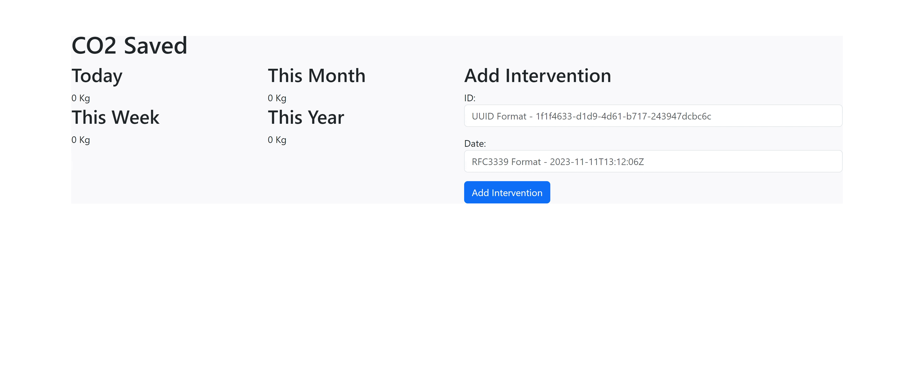

## goco2 - a CO2 emission saving microservice

goco2 is a REST microservice written in go, its aim is to compute CO2
emission saving based on the efficiency upgrade interventions.  
The microservice also expose a simple UI (mostly generated by ChatGPT)
for displaying saved CO2 information, and to add intervention data.
Open the browser and point to the `http://host:port` URL to display the GUI

    
Security (of the web server, as well as authentication/authorization) is out of the scope of 
this implementation, also it could be addressed outside the microservice itself and
performed at an API gateway/mesh network level.

Moreover, this implementation allows for context based management of the service calls, even
though it does not actively use it (overkill for such a simple example where the data is in mem)

Finally, implementation is based on http package from standard library,
any amazing go web library would works perfectly fine, such as gin, gorilla, fiber etc.  
Same for logging, we could have used some funky json log library such
as logrus or zap but to keep things simple we stick with standard library.

### Usage
#### Dockerfile
Build:  
`docker build -t goco2 .`  
Run:  
`docker run --rm  -p 8000:8000 goco2`  

You may want to expose the listening HTTP port, with -p option.

Default listen on host 0.0.0.0 and port 8000
Override values by setting --env during docker run for the
HTTP_HOST and HTTP_PORT environment variables

#### Makefile
export HTTP_HOST and HTTP_PORT environment variables, then:  
Build:  
`make build`  
Build & run:  
`make run`  
Test:  
`make test`  
Docs:  
`make docs` - then open browser at: http://localhost:8080
#### Manual
From the cmd folder:  
Build:  
`go build -o goco2`  
Run:  
`./goco2 -host 0.0.0.0 -port 8000`  
If no CLI flag specified, HTTP_HOST and HTTP_PORT env variables are used,
otherwise specify with -host and -port CLI flags.

### API
API Documentation is provided as openapi specification.  
Display with swagger-ui:  
`docker run -p 8080:8080 --name goco2-openapi -e URL=openapi.yaml -v $PWD/openapi.yaml:/usr/share/nginx/html/openapi.yaml swaggerapi/swagger-ui`  
Or use make docs command

#### GET CO2 saving
Retrieves CO2 emission saving  
Method: GET  
Endpoint: /saving

curl example:  
`curl http://localhost:8000/saving`

#### POST Intervention
Add a new efficiency upgrade intervention  
Method: POST  
Endpoint: /intervention  
curl example:  
`curl -X POST --header "Content-Type: application/json"  -d '{"date": "2023-11-11T13:12:06Z"}'  -v http://localhost:8000/intervention`
